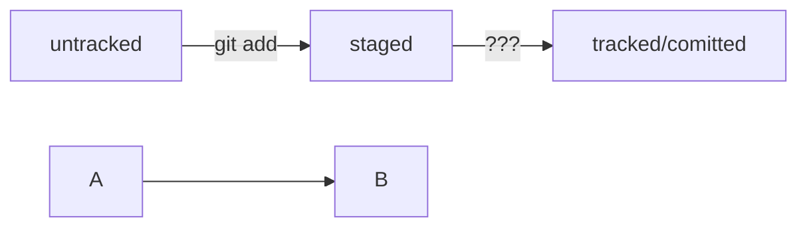

# git-hints

## Небольшой гит-репозиторий для самостоятельной работы

`git clone https://github.com/PraktikumJava/git-hints.git`

## Изучили тему про хеш, лог
Информацию по каждому разделу (хеш, лог, HEAD, статусы файлов, стили оформления сообщений к коммитам)

HEAD -- это голова.
Коммит -- это всему голова.
Статусы файлов:
<тут пустая строка!>

```python
%% описание схемы
def sum_to_n(n):
    return sum(range(1, n + 1))

try:
    number = int(input("Введите число N: "))
    result = sum_to_n(number)
    print(f"Сумма чисел от 1 до {number} = {result}")
except ValueError:
    print("Ошибка: введите целое число.")

```


<и тут пустая строка!>